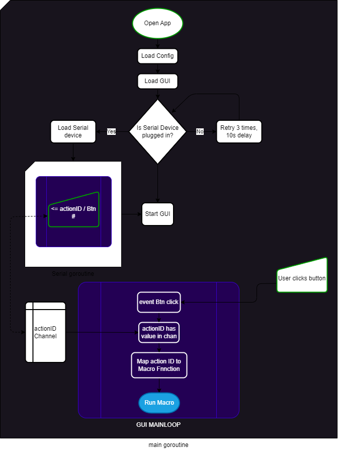

# Go-MMP
MiniMacroPad driver software, written in Golang. 

This is a re-write of https://github.com/ssebs/MiniMacroPad/

TODO: Use this keyboard lib git.tcp.direct/kayos/sendkeys

## Usage
- Clone this repo
  - You'll need to install a C compiler. See https://developer.fyne.io/started/
- `go run main.go`
<!-- - go install github.com/ssebs/go-mmp -->

## Building
- Make sure `fyne` CLI is installed
  - `go install fyne.io/fyne/v2/cmd/fyne@latest`
- Windows:
  - `PS go-mmp> fyne package -os windows`
- Mac:
  - `$ fyne package -os darwin`
- Linux:
  - `$ fyne package -os linux`

## Goals
- [x] Get started
- [WIP] Create basic UI
- [WIP] Run keyboard macros
- [ ] Load buttons from config into GUI
- [x] Listen for Serial data
  - [x] Take action from this data
  - [x] Add support for shortcuts/hotkeys
  - [x] Add support for running single keys
  - [ ] Add support for strings (see py keyboard lib!)
  - [ ] Add support for mouse?
- [ ] CRUD a config file
  - [ ] Support many macros/devices
- [ ] UI for CRUD'ing these macros
- [ ] Support clicking on the button
- [ ] Support keyboard shortcuts?
- [ ] CLI for GUI only, and no-GUI modes

## Architecture Diagram
> To update it, edit the [Architecture.drawio](./res/Architecture.drawio) file. I'm using [this](https://open-vsx.org/extension/hediet/vscode-drawio) VSCode extension.
> 
.

## Docs / References:
- GUI (fyne)
  - https://developer.fyne.io/
  - https://github.com/fyne-io/fyne/tree/master/cmd/fyne_demo
- Serial
  - https://github.com/bugst/go-serial
- Keyboard
  - https://github.com/micmonay/keybd_event
- Existing thing I want to improve
  - https://github.com/ssebs/MiniMacroPad/

## LICENSE
[Apache 2 License](./LICENSE)