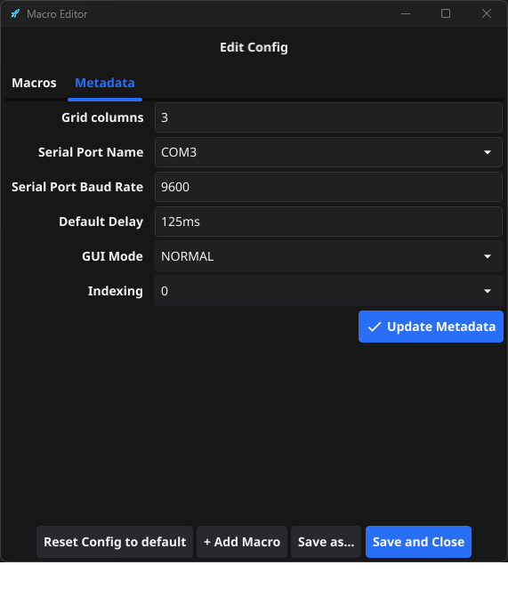

# Mini Macro Pad (go-mmp) <!-- omit in toc -->

**Mini Macro Pad (go-mmp)** is a tool for creating and running macros, shortcuts, and other automated actions at the press of a button. 

It works with hardware like Arduino-based macro pads or directly through a desktop GUI.

> Want to learn more? Check out the [blog post](https://ssebs.com/blog/minimacropad)

**Table of Contents:** <!-- omit in toc -->
- [What kind of macros can you make?](#what-kind-of-macros-can-you-make)
- [You can add multiple "actions" to a macro](#you-can-add-multiple-actions-to-a-macro)
- [Getting started](#getting-started)
- [Getting set up](#getting-set-up)
- [Change your Macros on the fly](#change-your-macros-on-the-fly)
- [3D Printing \& Hardware](#3d-printing--hardware)
  - [Got an arduino all hooked up?](#got-an-arduino-all-hooked-up)
- [Install dependencies \& get the code](#install-dependencies--get-the-code)
- [Build and run the code](#build-and-run-the-code)
- [LICENSE](#license)
- [Contributing to go-mmp](#contributing-to-go-mmp)

  

## What kind of macros can you make?
- Shortcuts:
  - CTRL+C, CTRL+V, CTRL+SHIFT+ESC, etc.
- Adding Media keys to skip songs, change the volume, or even add back the HOME and DELETE keys to a TKL keyboard.
  - You can press whatever key you want, as long as it's [in the list](https://github.com/go-vgo/robotgo/blob/master/docs/keys.md#keys).
- Macros:
  - Type "gg" in game, rage quit a game, or do something more useful in Excel!
- Repeat keypresses (or mouse button presses)
  - Playing cookie clicker? Press your macro to repeatedly press your mouse button down until you click the macro again
- Whatever you can think of, feel free to submit PRs!

## You can add multiple "actions" to a macro
If you want a single button to type "gg" for you in VALORANT or CS, you can!
- You just need to add 3 actions:
  - `Shortcut: shift+enter`
  - `SendText: gg`
  - `PressRelease: enter`
- See [Actions.md](./Actions.md) to learn more

## Getting started
If you have a arduino/serial macro pad ready, great! You get to use the full functionality of go-mmp! 

See the the [3D Printing \& Hardware](#3d-printing--hardware) section to get started with the physical device.

Don't have an Arduino but still want to run macros? You can use the GUI-only mode, which is the default, so you're all set!

Just click on the buttons to run Macros.

## Getting set up
- [Download the latest exe](https://github.com/ssebs/go-mmp/releases/)
- Double click the **Mini Macro Pad.exe** file
- It will generate a configuration file in your home folder.
    - e.g. `C:\Users\ssebs\mmpConfig.yml` or `/home/ssebs/mmpConfig.yml`
- When you press a button on the Arduino based MacroPad, it will run a Macro that's set in your config.

## Change your Macros on the fly
New in `v2`, you can now update your Macros in the UI instead of from the config file.

Just go to **Edit** > **Edit Config**, and drag-and-drop your macros into the correct positions

Click on the name to change what they do.

Here's the "**gg**" Macro for example:

## 3D Printing & Hardware
You'll need a microcontroller, some key switches, and a 3D Printer. I'm using a Teensy LC, but you could use an Arduino Micro or ESP32.

My 3D Printed housing is available on [thangs.com](https://than.gs/m/710028).

Wiring under the hood (please forgive the newbie soldering)

### Got an arduino all hooked up?
- You'll need an arduino/serial based device that sends [0-9] numbers over a serial connection.
  - See the [arduino-mmp.ino](./arduino-mmp.ino) source code.
  - > Connecting and understanding baudrate, etc. is out of the scope of this guide.
- Just edit your config, edit metadata, and set the Serial Port Name, Baud rate, and change `GUIMode` to `NORMAL`.
  - If your device sends 1 for the first button instead of 0, you can set the Indexing setting to 1
  - Medatata Editor:
  - 

## Install dependencies & get the code
- Install [Golang](https://go.dev/doc/install)
- Follow the fyne install docs at https://docs.fyne.io/started/
  - This takes a while but is required.
- If running on linux
  - Add yourself to the `dialout` group
    - `sudo usermod -aG dialout <username>`
  - Install GTK3-dev
    - > This is for the file dialogs
    - `sudo apt install libgtk-3-dev`
- Source:
  - `git clone https://github.com/ssebs/go-mmp`
- Go pkg
  - `go get github.com/ssebs/go-mmp`

## Build and run the code
- Running the code:
  - `go run main.go` 
- Unit tests:
  - `go test ./...`
- Coverage
  - `go test ./...  -coverpkg=./... -coverprofile ./coverage.out`
  - `go tool cover -func ./coverage.out`
- To package:
  - Make sure `fyne` CLI is installed
    - `go install fyne.io/fyne/v2/cmd/fyne@latest`
    - `go install github.com/fyne-io/fyne-cross@latest` for cross platform pkging
  - Windows:
    - `PS go-mmp> fyne package -os windows`
      - Linux pkg for Win:
        - `fyne-cross windows`
  - Mac:
    - `$ fyne package -os darwin`
  - Linux:
    - `$ fyne package -os linux`
- Updating:
  - Make code changes 
  - Run upgrades: `go get -u && go mod tidy`
  - Update Version in `FyneApp.toml`
  - Create Pull Request
  - Once committed, git tag & push with same version from `FyneApp.toml`
  - Create release and upload exe and tar.xz 
  - `go get github.com/ssebs/go-mmp@<version>`
- Testing with a virtual serial device (Linux)
  - If you don't have a physical serial device, you can still simulate button presses.
  - Install `socat`, and open up two terminals
  - `$ socat -d -d PTY,raw,echo=0 PTY,raw,echo=0`
    - You'll get two `/dev/pts/<num>` devices listed, the first one is what you set in your config, and the second is used to send data.
  - `$ echo -n "<num>" > /dev/pts/num2`
    - e.g. use num 0 to press the first button

> If you're curious, check out the older python code at https://github.com/ssebs/MiniMacroPad/

## LICENSE
Licensed under the [Apache 2 License](./LICENSE).

## Contributing to go-mmp
- **Open an Issue**: 
  - Link to an existing issue or create a new one, ensuring it’s tagged (e.g., `feature`, `bug`).
- **Fork & Clone**: 
  - Fork the repo, clone it, and make your changes.
- **Write Tests**: 
  - Add or update tests to cover your changes. Run `go test ./...` to ensure all tests pass.
- **Submit a PR**: 
  - Create a pull request referencing the issue (e.g., `Fixes #<issue-number>`). 
  - Include before/after examples in your PR. (screenshots or .gifs)
